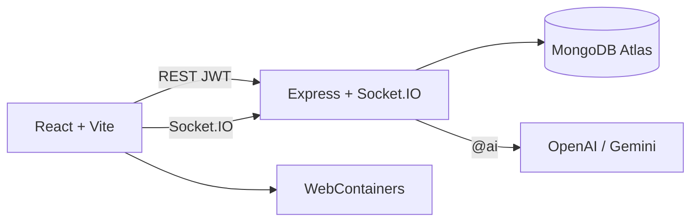

# Nexora — Live AI coding rooms

Live app: [https://nexora-coding.vercel.app](https://nexora-coding.vercel.app)

API: [https://real-time-ai-powered-chat-app-with-mern.onrender.com](https://real-time-ai-powered-chat-app-with-mern.onrender.com)

Nexora is a **MERN** workspace for live collaboration. Users open a room, chat over **Socket.IO**, ask **@ai** to generate a file tree, edit the code, and run it in the browser with **WebContainers**.

The API is on Render’s free tier and may sleep when idle. Wait until the status pill says **Live** before signing in.

---

## Features

- JWT auth and persistent sessions
- Solo, one-to-one, and group rooms
- Real-time chat (text and small images)
- `@ai` generates a runnable file tree in the room
- Shared editor and in-browser Node via WebContainers (Chrome)

## Stack

| Layer | Tech |
| --- | --- |
| Frontend | React, Vite, Tailwind, Socket.IO client, WebContainers |
| Backend | Node.js, Express, Socket.IO |
| Database | MongoDB Atlas (Mongoose) |
| Auth | JWT, bcrypt, optional Redis token blacklist |
| AI | OpenAI (`gpt-4o-mini`) with Gemini fallback |
| Deploy | Vercel (frontend) · Render (API) |

## Architecture



---

## Local setup

### Backend

```bash
cd backend
npm install
cp .env.example .env
npm run dev
```

`backend/.env`:

```bash
MONGO_URI=your_mongodb_atlas_uri
JWT_SECRET=long_random_string
CLIENT_URL=http://localhost:5173
OPENAI_API_KEY=sk-your-key
```

Keep `OPENAI_API_KEY` on the server only (local `.env` and Render). Do not commit it or expose it to the frontend.

Optional: `GOOGLE_AI_KEY` is used only if OpenAI is not set.

### Frontend

```bash
cd frontend
npm install
cp .env.example .env
npm run dev
```

`frontend/.env`:

```bash
VITE_API_URL=http://localhost:3000
```

Open [http://localhost:5173](http://localhost:5173).

---

## Production

1. **Render → Environment:** `MONGO_URI`, `JWT_SECRET`, `CLIENT_URL=https://nexora-coding.vercel.app`, `OPENAI_API_KEY`
2. **MongoDB Atlas → Network Access:** allow the API host (or `0.0.0.0/0` for a public demo). Resume the cluster if it is paused.
3. **Vercel → Environment:** `VITE_API_URL` = the Render API URL

---

## Project layout

```
backend/     Express API + Socket.IO
frontend/    Vite React app
```

## License

MIT
