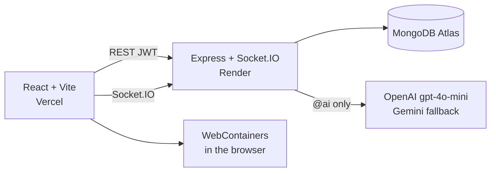

# Nexora — Live AI coding rooms

**Live demo:** [https://nexora-coding.vercel.app](https://nexora-coding.vercel.app)  
**API:** [https://real-time-ai-powered-chat-app-with-mern.onrender.com](https://real-time-ai-powered-chat-app-with-mern.onrender.com)

Nexora is a MERN product I built and deployed: WhatsApp-style rooms (solo, 1:1, or group), Socket.IO chat, an in-room editor, `@ai` file generation, and Node running in the browser via WebContainers.

It is a **shared coding room**, not a chatbot wrapper. I use it as the main full-stack + GenAI piece on my resume.

> First load: wait until the pill says **Live**. The API is on Render’s free tier and sleeps when idle. Signup/login will fail if you click before that.

---

## Demo (what to click)

1. Wait for **Live**.
2. Create an account (or sign in).
3. **New group room** or **Message someone**.
4. Tap **Express homepage** (or type `@ai create an Express homepage…`).
5. Open a file, change a line, press **Run** in **Chrome on desktop**.
6. Optional: attach a small image in chat, or Invite another account.

Chrome is required for **Run**. Chat, files, and `@ai` still work in other browsers.

---

## Architecture



| Layer | Choice |
| --- | --- |
| Frontend | React, Vite, Tailwind, Socket.IO client, WebContainers |
| Backend | Node.js, Express, Socket.IO |
| Database | MongoDB Atlas (Mongoose) |
| Auth | JWT + bcrypt (optional Redis logout blacklist) |
| AI | OpenAI `gpt-4o-mini`, Gemini only if OpenAI fails |
| Hosting | Vercel (UI) · Render (API) |

`OPENAI_API_KEY` lives only on Render. It is not in the frontend, GitHub, or `.env.example`.

---

## What I built

I designed and shipped the product loop myself (auth → rooms → live chat → `@ai` → editor → Run), then hardened it for a public URL: CORS, Mongo reconnect, invite list refresh, mobile room tabs, `@ai` rate limits, and deploy.

Libraries I did **not** invent: Express, Mongoose, Socket.IO, OpenAI SDK, WebContainers, Highlight.js. The wiring, room model, UI, and production fixes are mine.

**Honest limits (fine to ask in an interview):**

- File sync is **last-write-wins**, not OT / CRDT. Two people editing the same line can overwrite.
- `@ai` is capped (8 calls / 15 min per account). Greetings like `@ai hi` do not hit the model.
- Images in chat are small (JPG/PNG/WebP/GIF, under 500 KB) and stored on the message document.
- Render cold start is real. The Live pill is there on purpose.

---

## AI usage (why it does not burn a $5 key)

- The old public `GET /ai/get-result?prompt=` route is gone. Generation only runs from an authenticated room socket (or an authenticated POST).
- Output is capped (`max_tokens` / `maxOutputTokens`).
- Prompts are clipped. Duplicate in-flight jobs per user are dropped.
- Gemini model listing is cached so a fallback does not list models on every request.

---

## Local setup

**API**

```bash
cd backend
npm install
cp .env.example .env
npm run dev
```

`backend/.env`: `MONGO_URI`, `JWT_SECRET`, `CLIENT_URL=http://localhost:5173`, `OPENAI_API_KEY`.

**UI**

```bash
cd frontend
npm install
cp .env.example .env
npm run dev
```

`frontend/.env`: `VITE_API_URL=http://localhost:3000`  
Open [http://localhost:5173](http://localhost:5173).

---

## Production

1. **Render:** `MONGO_URI`, `JWT_SECRET`, `CLIENT_URL=https://nexora-coding.vercel.app`, `OPENAI_API_KEY`
2. **Atlas:** allow Render (`0.0.0.0/0` is fine for a demo). Resume the cluster if it paused.
3. **Vercel:** `VITE_API_URL` = the Render URL

---

## Layout

```
backend/    Express API + Socket.IO
frontend/   Vite React app
```

MIT
